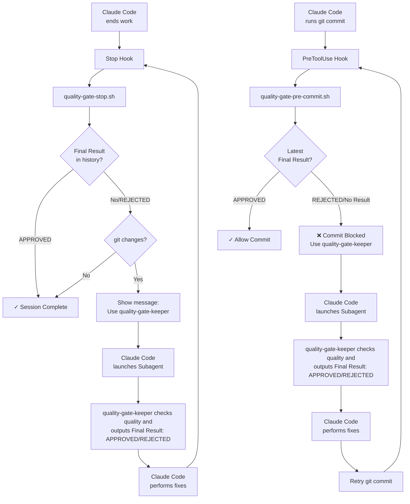

# Claude Code Quality Gate Example

A complete quality automation system using Claude Code Hooks and Subagents to enforce code quality standards automatically.

**In simple terms**: A system that uses Hooks to repeatedly launch quality-gate-keeper Subagent and perform fixes until it says `Final Result: ✅ APPROVED`.

> **⚠️ Note**: This system may cause infinite loops if quality standards are too strict. Adjust quality-gate-keeper.md or modify scripts if needed.

## How to Install (Plugin)

1. Install from GitHub (recommended):
   ```
   /plugin marketplace add takahirom/claude-code-quality-gate-example
   /plugin install claude-code-quality-gate-example@claude-code-quality-gate-example
   ```

2. Ensure dependencies are installed:
   ```bash
   # macOS
   brew install jq
    
    # Ubuntu/Debian
    sudo apt-get install jq
    ```

> Legacy note: The previous setup used project hooks in `.claude/settings.json` and a symlinked agent. The plugin install replaces both, so `.claude/` is no longer required.

## Execution Flow



## Components

### Hooks
- **Stop**: Launches `quality-gate-stop.sh` when work ends - checks transcript history for Final Result
- **PreToolUse**: Launches `quality-gate-pre-commit.sh` on git commit - blocks commit unless APPROVED
  - Plugin hooks rely on `CLAUDE_PLUGIN_ROOT` (provided by Claude Code) to resolve script paths

### Subagents
- **quality-gate-keeper**: Analyzes code quality and outputs clear verdicts
  - Must end with `Final Result: ✅ APPROVED` or `Final Result: ❌ REJECTED`
  - Focuses on session changes only
  - Applies "Less is More" principle
  - Detects testing cheats and shortcuts

## Testing

### E2E Testing
Run the complete test suite:
```bash
./tests/e2e-test.sh
```

### Integration Testing
Run quality gate integration tests:
```bash
./tests/test-quality-gate-integration.sh
```

### All Tests
Run all tests (used in CI):
```bash
./tests/test-functions.sh
./tests/test-quality-gate-integration.sh
./tests/test-edge-cases.sh
```

This validates the entire workflow from test creation to quality intervention.

## Key Features

### System Behavior
The system uses quality-gate-keeper's direct output for decision making:

1. **Direct Result Checking**: Parses transcript for `Final Result: ✅ APPROVED` or `Final Result: ❌ REJECTED`
2. **Stale Approval Detection**: Automatically invalidates old approvals after file edits
3. **Manual Override**: Type `SKIP QG` to bypass quality gate checks when needed
4. **Loop Prevention**: Automatically stops after 10 quality check attempts to prevent infinite loops


## Important Notes

- **REJECTED Handling**: Unlike the old passphrase system, you must actually fix issues - no shortcuts allowed
- **Infinite Loop Risk**: Quality standards that are too strict may cause loops. Adjust quality-gate-keeper.md or scripts as needed
- **Experimental System**: Test in a safe environment first  
- **Use at Your Own Risk**: No warranty or support provided
