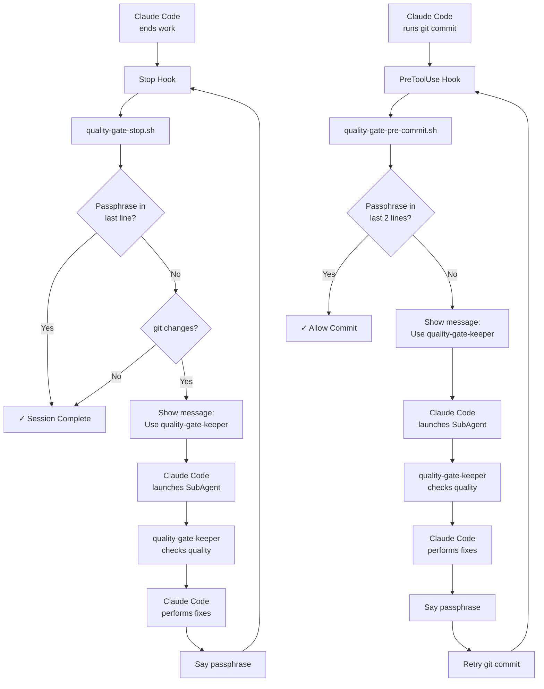

# Claude Code Quality Gate Example

A complete quality automation system using Claude Code Hooks and SubAgents to enforce code quality standards automatically.

> **⚠️ Note**: The passphrase system may cause infinite loops if quality standards are too strict. Use at your own risk.

## How to Install (Global Settings)

1. Clone this repository:
   ```bash
   git clone https://github.com/takahirom/claude-code-quality-gate-example.git ~/claude-quality-gate
   chmod +x ~/claude-quality-gate/.claude/scripts/*.sh
   ```

2. Add to your global Claude Code settings (`~/.claude/settings.json`):
   ```json
   {
     "hooks": {
       "PreToolUse": [
         {
           "matcher": "Bash",
           "hooks": [
             {
               "type": "command",
               "command": "~/claude-quality-gate/.claude/scripts/quality-gate-pre-commit.sh",
               "timeout": 30
             }
           ]
         }
       ],
       "Stop": [
         {
           "matcher": "*",
           "hooks": [
             {
               "type": "command",
               "command": "~/claude-quality-gate/.claude/scripts/quality-gate-stop.sh",
               "timeout": 30
             }
           ]
         }
       ]
     }
   }
   ```

3. Link the SubAgent definition:
   ```bash
   mkdir -p ~/.claude/agents
   ln -s ~/claude-quality-gate/.claude/agents/quality-gate-keeper.md ~/.claude/agents/
   ```

4. Ensure dependencies are installed:
   ```bash
   # macOS
   brew install jq
   
   # Ubuntu/Debian
   sudo apt-get install jq
   ```

## Execution Flow



## Components

### Hooks
- **Stop**: Launches `quality-gate-stop.sh` when work ends - prompts SubAgent activation if changes detected
- **PreToolUse**: Launches `quality-gate-pre-commit.sh` on git commit - prompts SubAgent activation if quality check needed

### SubAgents
- **quality-gate-keeper**: Analyzes code quality and provides recommendations
  - Focuses on session changes only
  - Applies "Less is More" principle
  - Detects testing cheats and shortcuts

## E2E Testing

Run the complete test suite:
```bash
./e2e-test.sh
```

This validates the entire workflow from test creation to quality intervention.

## Key Features

### Magic Passphrase System
The system supports two passphrase patterns to balance quality and speed:

1. **Approval Pattern** (default): `"I have launched the quality gate keeper subagent and received approval"`
   - Requires approval from quality-gate-keeper SubAgent
   - More quality-focused approach

2. **Address-All Pattern**: `"I have launched the quality gate keeper subagent and addressed all requests"`
   - Proceeds once fixes are completed
   - More speed-focused approach

Configure the passphrase in `common-config.sh` to switch between patterns.


## Important Notes

- **Experimental System**: Test in a safe environment first
- **Use at Your Own Risk**: No warranty or support provided

