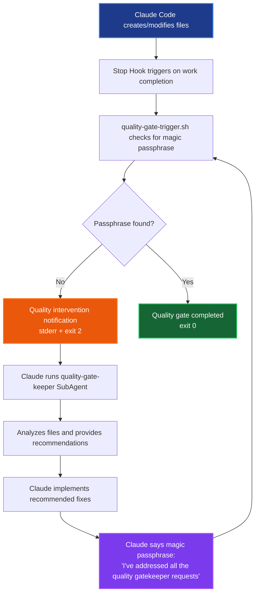

# Claude Code Quality Gate Automation System

A complete quality automation system using Claude Code Hooks and SubAgents to enforce code quality standards automatically.

> **⚠️ Disclaimer**: This system is provided as-is for educational and experimental purposes. Use at your own risk. The authors are not responsible for any issues, data loss, or unexpected behavior that may occur from using this automation system. Please test thoroughly in a safe environment before using in production.

## Features

- **Quality Gate Enforcement**: Automatic quality checks on work completion
- **SubAgent Integration**: Structured analysis and recommendations via quality-gate-keeper
- **Passphrase-based Loop Prevention**: Uses magic phrases to control workflow
- **Less is More Principle**: Focuses on essential tests (3-5) over exhaustive coverage
- **Session-scoped Analysis**: Only analyzes files modified in current session
- **Anti-cheat Detection**: Identifies testing shortcuts and bypasses
- **E2E Testing**: Complete workflow validation

## System Architecture



## Components

### Hooks
- **Stop**: Triggers quality gate on work completion

### SubAgents
- **quality-gate-keeper**: Analyzes code quality and provides recommendations
  - Focuses on session changes only
  - Applies "Less is More" principle
  - Detects testing cheats and shortcuts

### Scripts  
- **quality-gate-trigger.sh**: Main quality gate controller with passphrase detection

## Usage

1. **Setup**: Place the system in your project's `.claude/` directory
2. **Development**: Code normally - the system monitors automatically  
3. **Quality Gate Triggered**: When you complete work, the system will prompt:
   ```
   ✅ Work completion detected. Please launch quality-gate-keeper Agent to perform quality inspection.
   🔧 Then implement all recommended fixes immediately without asking.
   💡 When all fixes are complete, please say: 'I've addressed all the quality gatekeeper requests'
   ```
4. **Execute Quality Gate**: Run the SubAgent as prompted:
   ```
   Use quality-gate-keeper to analyze all files and receive actionable recommendations.
   ```
5. **Complete the Cycle**: After implementing fixes, say the magic passphrase to complete the quality gate

## E2E Testing

Run the complete test suite:
```bash
./test-e2e-isolated.sh
```

This validates the entire workflow from test creation to quality intervention.

## Configuration

The system is configured in `test/.claude/settings.json` with relative paths for portability:

```json
{
  "hooks": {
    "Stop": [
      {
        "matcher": "*",
        "hooks": [
          {
            "type": "command", 
            "command": "./.claude/scripts/quality-gate-trigger.sh",
            "timeout": 30
          }
        ]
      }
    ]
  }
}
```

## Key Features

### Magic Passphrase System
The system uses `"I've addressed all the quality gatekeeper requests"` as a completion signal to prevent infinite loops while ensuring all quality issues are resolved.

### Quality Gate Philosophy
- **Less is More**: Recommends 3-5 essential tests instead of exhaustive suites
- **Session-focused**: Only analyzes files modified in current work session
- **Anti-cheat**: Detects testing shortcuts and bypasses

This ensures the system works across different user environments without hardcoded paths.

## Important Notes

- **Experimental System**: Test in a safe environment first
- **Use at Your Own Risk**: No warranty or support provided

