# Claude Code Quality Gate Automation System

A complete quality automation system using Claude Code Hooks and SubAgents to enforce code quality standards automatically.

> **⚠️ Disclaimer**: This system is provided as-is for educational and experimental purposes. Use at your own risk. The authors are not responsible for any issues, data loss, or unexpected behavior that may occur from using this automation system. Please test thoroughly in a safe environment before using in production.

## How to Install (Global Settings)

1. Copy the scripts to a permanent location:
   ```bash
   mkdir -p ~/claude-quality-gate
   cp -r .claude/scripts ~/claude-quality-gate/
   chmod +x ~/claude-quality-gate/scripts/*.sh
   ```

2. Add to your global Claude Code settings (`~/.claude/settings.json`):
   ```json
   {
     "hooks": {
       "PreToolUse": [
         {
           "matcher": "Bash",
           "hooks": [
             {
               "type": "command",
               "command": "~/claude-quality-gate/scripts/quality-gate-pre-commit.sh",
               "timeout": 30
             }
           ]
         }
       ],
       "Stop": [
         {
           "matcher": "*",
           "hooks": [
             {
               "type": "command",
               "command": "~/claude-quality-gate/scripts/quality-gate-stop.sh",
               "timeout": 30
             }
           ]
         }
       ]
     }
   }
   ```

3. Copy the SubAgent definition:
   ```bash
   mkdir -p ~/.claude/agents
   cp .claude/agents/quality-gate-keeper.md ~/.claude/agents/
   ```

4. Ensure dependencies are installed:
   ```bash
   # macOS
   brew install jq
   
   # Ubuntu/Debian
   sudo apt-get install jq
   ```

## System Architecture

```mermaid
flowchart TD
    A[Claude Code<br/>ends work] --> B[Stop Hook] 
    B --> C[quality-gate-stop.sh]
    C --> D{Passphrase in<br/>last line?}
    D -->|Yes| E[✓ Session Complete]
    D -->|No| F{git changes?}
    F -->|No| E
    F -->|Yes| G[Show message:<br/>Use quality-gate-keeper]
    G --> H[Claude Code<br/>launches SubAgent]
    H --> I[quality-gate-keeper<br/>checks quality]
    I --> J[Claude Code<br/>performs fixes]
    J --> K[Say passphrase]
    K --> B
    
    L[Claude Code<br/>runs git commit] --> M[PreToolUse Hook] 
    M --> N[quality-gate-pre-commit.sh]
    N --> O{Passphrase in<br/>last 2 lines?}
    O -->|Yes| P[✓ Allow Commit]
    O -->|No| Q[Show message:<br/>Use quality-gate-keeper]
    Q --> R[Claude Code<br/>launches SubAgent]
    R --> S[quality-gate-keeper<br/>checks quality]
    S --> T[Claude Code<br/>performs fixes]
    T --> U[Say passphrase]
    U --> V[Retry git commit]
    V --> M
```



## Components

### Hooks
- **Stop**: Triggers quality gate on work completion
- **PreToolUse**: Blocks git commits until quality standards are met

### SubAgents
- **quality-gate-keeper**: Analyzes code quality and provides recommendations
  - Focuses on session changes only
  - Applies "Less is More" principle
  - Detects testing cheats and shortcuts

### Scripts  
- **quality-gate-stop.sh**: Main quality gate controller with passphrase detection
- **quality-gate-pre-commit.sh**: Pre-commit quality gate that blocks commits until standards are met

## Usage

1. **Setup**: Place the system in your project's `.claude/` directory
2. **Development**: Code normally - the system monitors automatically  
3. **Quality Gate Triggered**: When you complete work, the system will prompt:
   ```
   ✅ Work completion detected. Please launch quality-gate-keeper Agent to perform quality inspection.
   🔧 Then implement all recommended fixes immediately without asking.
   💡 When all fixes are complete, please say: 'I've addressed all the quality gatekeeper requests'
   ```
4. **Pre-commit Gate**: When attempting to commit, the system will block until quality is ensured:
   ```
   🔍 Quality check required. Launch quality-gate-keeper Agent, fix issues, then say: 'I've addressed all the quality gatekeeper requests' before commit
   ```
5. **Execute Quality Gate**: Run the SubAgent as prompted:
   ```
   Use quality-gate-keeper to analyze all files and receive actionable recommendations.
   ```
6. **Complete the Cycle**: After implementing fixes, say the magic passphrase to complete the quality gate and allow commits

## E2E Testing

Run the complete test suite:
```bash
./e2e-test.sh
```

This validates the entire workflow from test creation to quality intervention.

## Configuration

The system is configured in `.claude/settings.json` with relative paths for portability:

```json
{
  "hooks": {
    "PreToolUse": [
      {
        "matcher": "Bash",
        "hooks": [
          {
            "type": "command",
            "command": "./.claude/scripts/quality-gate-pre-commit.sh",
            "timeout": 30
          }
        ]
      }
    ],
    "Stop": [
      {
        "matcher": "*",
        "hooks": [
          {
            "type": "command", 
            "command": "./.claude/scripts/quality-gate-stop.sh",
            "timeout": 30
          }
        ]
      }
    ]
  }
}
```

## Key Features

### Magic Passphrase System
The system supports two passphrase patterns to balance quality and speed:

1. **Approval Pattern** (default): `"I have launched the quality gate keeper subagent and received approval"`
   - Requires approval from quality-gate-keeper SubAgent
   - More quality-focused approach

2. **Address-All Pattern**: `"I have launched the quality gate keeper subagent and addressed all requests"`
   - Proceeds once fixes are completed
   - More speed-focused approach

Configure the passphrase in `common-config.sh` to switch between patterns.


## Important Notes

- **Experimental System**: Test in a safe environment first
- **Use at Your Own Risk**: No warranty or support provided

